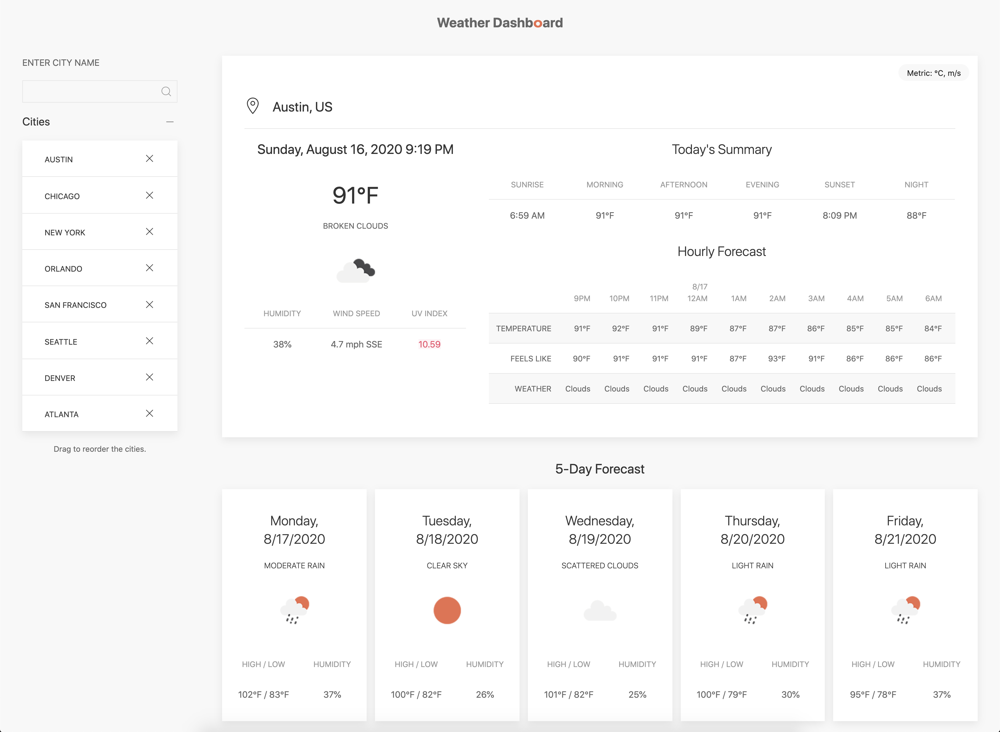
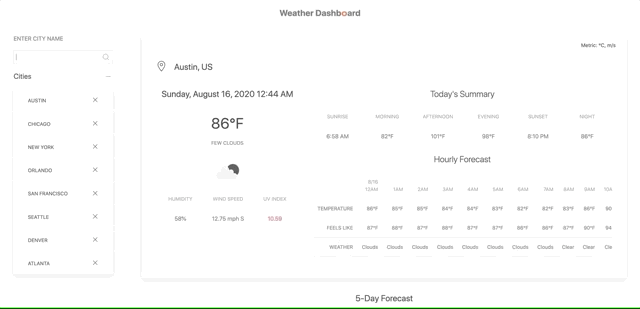
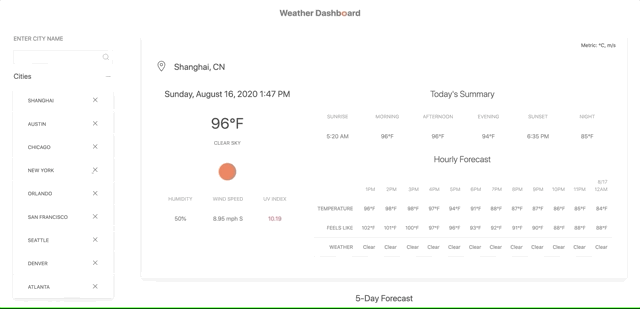
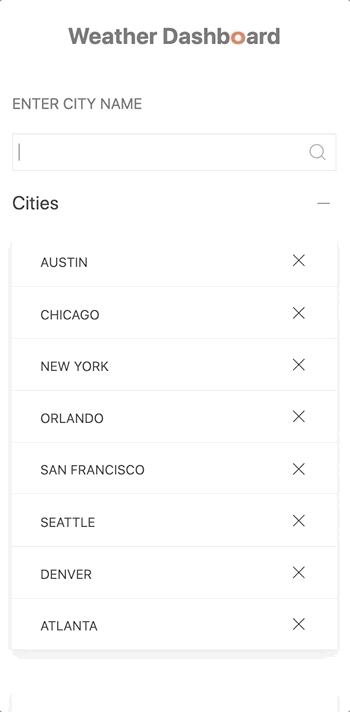
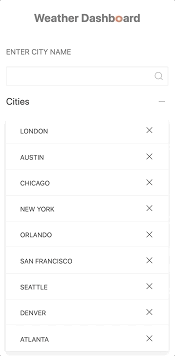

# 06 Server-Side APIs: Weather Dashboard

Built with HTML, UIKit, jQuery, OpenWeatherMap API, GeoNames API, Moment and Moment Timezone

URL of the deployed application: https://a-li-sa.github.io/weather-dashboard/

URL of the GitHub repository: https://github.com/a-li-sa/weather-dashboard

## Table of Contents 

* [Description](#description)
* [View](#view)
* [Usage](#usage)
* [Built With](#built-with)
* [Credits](#credits)
* [License](#license)

## Description

>Developers are often tasked with retrieving data from another application's API and using it in the context of their own. Third-party APIs allow developers to access their data and functionality by making requests with specific parameters to a URL. 

I built a weather dashboard that runs in the browser and features dynamically updated HTML and CSS. I used the [OpenWeather API](https://openweathermap.org/api) and the [GeoNames API](http://www.geonames.org/export/web-services.html) to retrieve weather data and timezones for cities. [Moment](https://momentjs.com/) and [Moment Timezone](https://momentjs.com/timezone/) were used in this application to display the dates on the weather forecast as well as the sunrise and sunset times. 

This application is for anyone, especially for travelers who want to see the weather outlook for multiple cities to plan a trip accordingly.

### Acceptance Criteria 
GIVEN a weather dashboard with form inputs
- [x] WHEN I search for a city THEN I am presented with current and future conditions for that city and that city is added to the search history
- [x] WHEN I view current weather conditions for that city THEN I am presented with the city name, the date, an icon representation of weather conditions, the temperature, the humidity, the wind speed, and the UV index
- [x] WHEN I view the UV index THEN I am presented with a color that indicates whether the conditions are favorable, moderate, or severe
- [x] WHEN I view future weather conditions for that city THEN I am presented with a 5-day forecast that displays the date, an icon representation of weather conditions, the temperature, and the humidity
- [x] WHEN I click on a city in the search history THEN I am again presented with current and future conditions for that city
- [x] WHEN I open the weather dashboard THEN I am presented with the last searched city forecast

## View

To view the website, you can click [here](https://a-li-sa.github.io/weather-dashboard/).

## Usage

In this application, the user can find the date and the following weather information for a particular city:

* Description of the weather conditions
* Current temperature
* Humidity percentage
* Wind speed in MPH and wind direction
* UV index (0-2: green, 3-7: yellow, 8+: red)
* Hourly forecast which displays the temperature, how it feels, and the weather description for the hour
* Sunrise and sunset times
* Summary of the day's temperatures

The page also shows the forecast for the next 5 days, displaying the description of the weather conditions, the highs and lows, and the humidity percentage for each day. 

This application displays temperatures in Fahenheit, or Celsius when the "°C / °F" button is clicked. 

Use the search input on the left to enter the name of a city, and then press the enter key or the search icon button. The city name gets added to the top of the collapsible list on the left side, and the city's information gets displayed on the right.

When the page is refreshed, the search inputs will be saved to the local storage, and the browser will display the weather information for the first city on the list.

To remove a city from the collapsible list, click the "X" button next to the city.

To view the information of a city on the list, click the city's name.

This webpage will also run on mobile devices. Clicking the search icon button or any city name on the collapsible list will scroll the page down to the weather information.

   
  

## Built With

* [HTML](https://html.spec.whatwg.org/) - Markup language used to define the structure of webpage.
* [UIKit](https://getuikit.com/) - A lightweight and modular CSS framework for developing responsive websites. Used in this application for styling HTML.
* [jQuery](https://jquery.com/) - JavaScript library that simplifies HTML client-side scripting. Used in this application to access APIs and dynamically create and update HTML elements.
* [OpenWeatherMap API](https://openweathermap.org/api) - API that provides weather data. Used to display almost all of the weather information in the application.
* [GeoNames API](http://www.geonames.org/export/web-services.html) - A geographical database. Used in this application to output timezone information from longitude and latitude inputs. 
* [Moment](https://momentjs.com/) - JavaScript library that helps with managing dates and time in the browser.
* [Moment Timezone](https://momentjs.com/timezone/) - JavaScript library that helps with managing timezones. Used in this application to display accurate sunrise and sunset times in the timezone of the city.

## Credits

Favicon created with [favicon.io](https://favicon.io/).

## License 

MIT License Copyright (c) 2020 Alisa Poon

